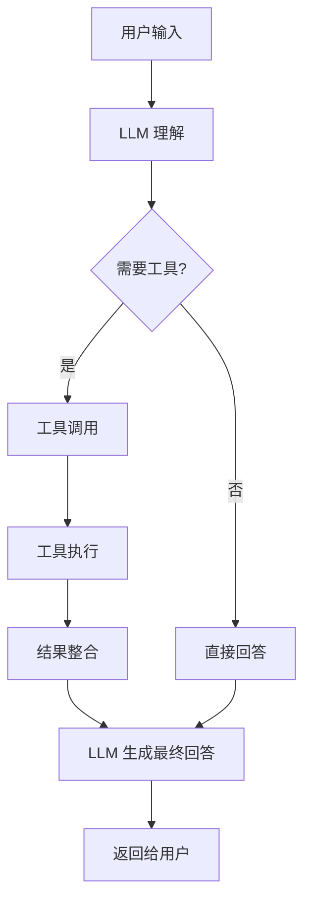
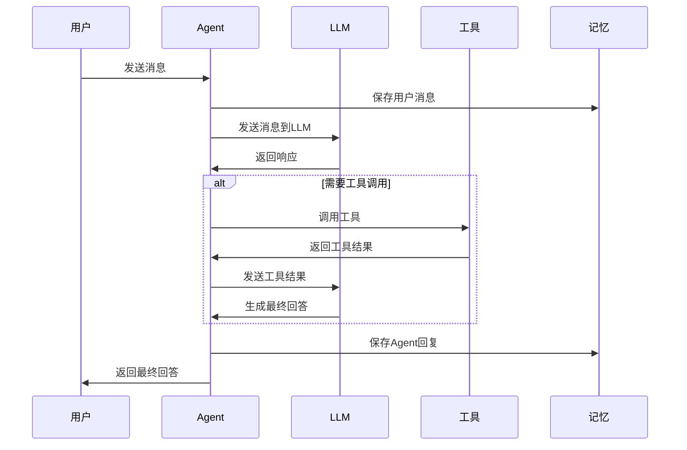

# LangChain4j AI Agent 设计与原理说明

## 一、LangChain4j 框架简介

LangChain4j 是 Java 生态下的 LLM（大语言模型）应用开发框架，提供了构建 AI 应用的完整工具链。它支持：

- 🤖 **Agent 构建**: 智能体开发，支持工具调用和决策
- 🔗 **Chain 编排**: 复杂工作流的链式处理
- 🧠 **Memory 管理**: 对话历史和上下文记忆
- 🔧 **Tool 集成**: 自定义工具和函数调用
- 📚 **RAG 支持**: 检索增强生成

## 二、AI Agent 核心原理

### 2.1 Agent 架构模式



### 2.2 核心组件

1. **ChatLanguageModel**: 语言模型接口，负责理解和生成文本
2. **Tool**: 工具接口，提供特定功能（如计算、查询等）
3. **Agent**: 智能体，协调 LLM 和工具的使用
4. **ChatMemory**: 对话记忆，维护上下文信息

## 三、项目架构设计

### 3.1 整体架构

```
┌─────────────────┐    ┌─────────────────┐    ┌─────────────────┐
│   用户界面层     │    │   Agent 层      │    │   工具层        │
│                 │    │                 │    │                 │
│  - 交互式对话    │◄──►│  - ToolAgent    │◄──►│  - Calculator   │
│  - 演示模式      │    │  - 决策逻辑      │    │  - Weather      │
│  - 命令行界面    │    │  - 工具协调      │    │  - Time         │
└─────────────────┘    └─────────────────┘    └─────────────────┘
                                │
                                ▼
                       ┌─────────────────┐
                       │   配置层        │
                       │                 │
                       │  - AgentConfig  │
                       │  - 环境变量管理  │
                       └─────────────────┘
```

### 3.2 包结构设计

```
src/main/java/
├── agent/                    # Agent 核心逻辑
│   └── ToolAgentDemo.java    # 主要的 Agent 实现
├── tools/                    # 工具集合
│   ├── CalculatorTool.java   # 数学计算工具
│   ├── WeatherTool.java      # 天气查询工具
│   └── TimeTool.java         # 时间查询工具
├── config/                   # 配置管理
│   └── AgentConfig.java      # Agent 配置类
└── main/                     # 程序入口
    └── App.java              # 主程序入口
```

## 四、核心模块详解

### 4.1 Agent 模块 (ToolAgentDemo)

**职责**:
- 初始化 LLM 模型
- 注册和管理工具
- 处理用户输入
- 协调工具调用
- 管理对话记忆

**关键特性**:
- 支持多种运行模式（交互式、演示式）
- 异常处理和错误恢复
- 工具调用日志记录

### 4.2 工具模块 (tools/)

#### 4.2.1 CalculatorTool
- **功能**: 基础数学运算
- **方法**: add, subtract, multiply, divide, square, sqrt
- **注解**: 使用 `@Tool` 标记，提供中文描述

#### 4.2.2 WeatherTool
- **功能**: 模拟天气查询
- **数据**: 内置城市天气数据
- **扩展性**: 支持动态添加新城市

#### 4.2.3 TimeTool
- **功能**: 时间相关查询
- **特性**: 支持时区转换、时间差计算
- **格式**: 标准时间格式处理

### 4.3 配置模块 (AgentConfig)

**配置项**:
- 模型参数（名称、温度、最大令牌数）
- 记忆设置（最大消息数）
- 工具调用限制
- 环境验证

## 五、工作流程详解

### 5.1 交互式对话流程



### 5.2 工具调用机制

1. **意图识别**: LLM 分析用户意图
2. **工具选择**: 选择合适的工具
3. **参数提取**: 从用户输入中提取参数
4. **工具执行**: 调用工具方法
5. **结果整合**: 将工具结果整合到回答中

## 六、扩展设计

### 6.1 新工具添加

```java
public class CustomTool {
    @Tool("工具描述")
    public String customMethod(String param) {
        // 实现逻辑
        return "结果";
    }
}
```

### 6.2 新模型集成

```java
// 支持其他 LLM 提供商
public class CustomModelConfig {
    public static ChatLanguageModel createCustomModel() {
        // 返回自定义模型实例
    }
}
```

### 6.3 高级功能

- **RAG 集成**: 文档检索和问答
- **多模态支持**: 图像、音频处理
- **流式响应**: 实时流式输出
- **插件系统**: 动态加载工具

## 七、性能优化

### 7.1 缓存策略
- 工具结果缓存
- 模型响应缓存
- 记忆优化

### 7.2 并发处理
- 异步工具调用
- 并行处理多个请求
- 连接池管理

### 7.3 资源管理
- 内存使用优化
- 网络连接复用
- 异常恢复机制

## 八、安全考虑

### 8.1 API 安全
- API Key 环境变量管理
- 请求频率限制
- 输入验证和清理

### 8.2 工具安全
- 工具调用权限控制
- 参数验证
- 异常处理

## 九、测试策略

### 9.1 单元测试
- 工具功能测试
- Agent 逻辑测试
- 配置验证测试

### 9.2 集成测试
- 端到端对话测试
- 工具调用测试
- 异常场景测试

### 9.3 性能测试
- 响应时间测试
- 并发处理测试
- 内存使用测试

## 十、部署方案

### 10.1 本地部署
```bash
mvn clean package
java -jar target/ai-agent-demo-langchain4j-1.0-SNAPSHOT.jar
```

### 10.2 Docker 部署
```dockerfile
FROM openjdk:8-jre
COPY target/ai-agent-demo-langchain4j-1.0-SNAPSHOT.jar app.jar
ENTRYPOINT ["java", "-jar", "/app.jar"]
```

### 10.3 云服务部署
- AWS Lambda
- Google Cloud Functions
- Azure Functions

## 十一、监控和日志

### 11.1 日志记录
- 工具调用日志
- 错误和异常日志
- 性能指标日志

### 11.2 监控指标
- 响应时间
- 成功率
- 工具使用频率
- 错误率

## 十二、未来规划

### 12.1 短期目标
- 增加更多工具
- 优化用户体验
- 完善错误处理

### 12.2 长期目标
- 支持更多 LLM 提供商
- 集成 RAG 功能
- 开发 Web 界面
- 支持多语言

## 十三、教学建议

### 13.1 学习路径
1. **基础概念**: 了解 AI Agent 和 LangChain4j
2. **工具开发**: 学习如何创建自定义工具
3. **Agent 构建**: 理解 Agent 的组装和配置
4. **高级特性**: 探索记忆、链式处理等

### 13.2 实践项目
- 开发新的工具
- 集成不同的 LLM
- 构建特定领域的 Agent
- 优化性能和用户体验

### 13.3 扩展阅读
- LangChain4j 官方文档
- OpenAI API 文档
- AI Agent 相关论文
- Java 并发编程 